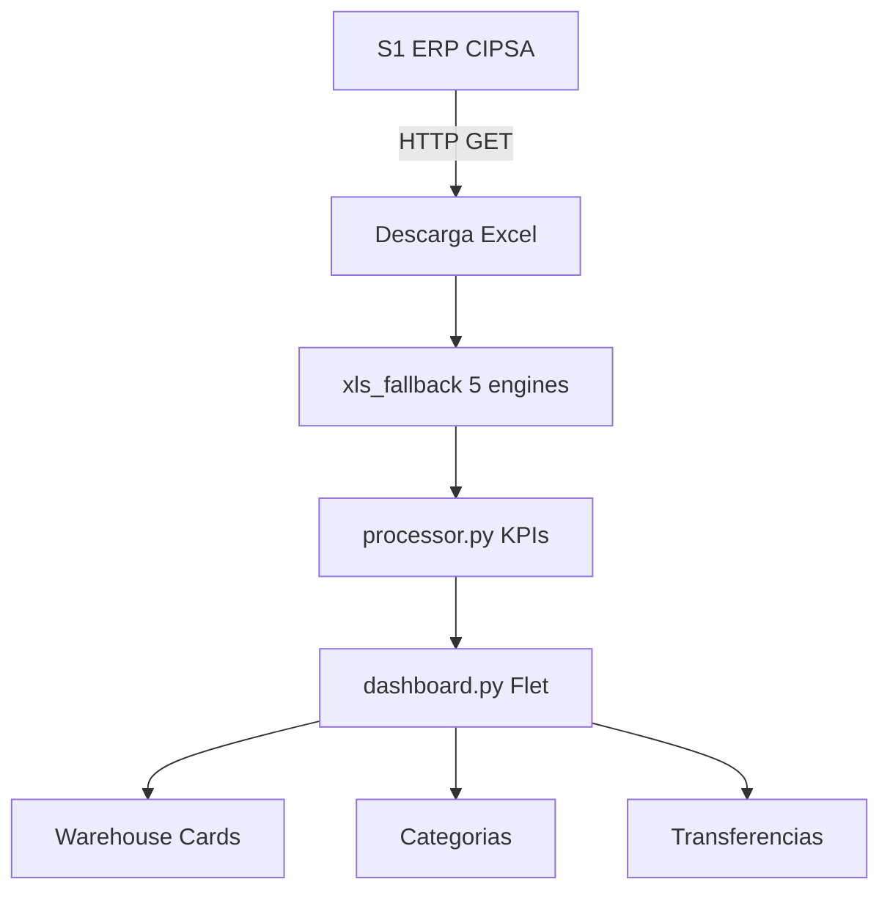

# G360 Stock Monitor

> Monitoreo de stock en tiempo real desde S1 (ERP CIPSA) con visualizacion por almacenes, lineas de producto y categorias. Incluye deteccion de transferencias sugeridas entre almacenes con alertas por desbalance y stock critico.

[](https://github.com/carloscus/g360-erp-stock-monitor)
[](https://python.org)
[](https://opensource.org/licenses/MIT)



---

## Tabla de Contenidos

- [Descripcion](#descripcion)
- [Caracteristicas](#caracteristicas)
- [Arquitectura](#arquitectura)
- [Estructura](#estructura)
- [Configuracion](#configuracion)
- [Dependencias](#dependencias)
- [Instalacion](#instalacion)
- [Uso](#uso)
- [Portable](#portable)
- [Decision Log](#decision-log)
- [Contribucion](#contribucion)
- [Licencia](#licencia)
- [Familia G360](#familia-g360)

---

## Descripcion

Aplicacion de escritorio que monitorea stock en tiempo real desde el ERP de CIPSA (S1). Descarga Excel desde S1, procesa datos por almacenes, lineas y categorias, y presenta un dashboard interactivo con KPIs, alertas y transferencias sugeridas.

**Tipo**: Desktop App (Portable)
**Framework**: Flet (Flutter-based Python)
**Plataforma**: Windows 10/11

---

## Caracteristicas

- **Dashboard general**: KPIs, warehouse cards, categorias, sidebar con search
- **6 KPIs clickables**: Almacenes, SKUs, Disponible, Predespacho, Alertas, Criticos
- **Health filter**: Filtro por salud (Critico/Alerta/OK) usando umbrales por cajas
- **Transferencias sugeridas**: Deteccion automatica de desbalance entre VES y secundarios
- **Warehouse cards**: 3 modos de display (DESAGREGADO, CONSOLIDADO, PCT)
- **Categorias**: VINIBALL, VINIFAN, REPRESENTADAS con sus lineas
- **Sidebar**: Search, chips de almacen, SKUs sin categoria, settings
- **Snapshot diff**: Tendencia (up/down) vs snapshot anterior
- **5 motores de lectura Excel**: openpyxl, xlrd, csv, html, xml
- **Version portable**: Carpeta autonoma con launcher auto-instalable

---

## Arquitectura

```
┌──────────────────────────────────────────────────────────────┐
│                    Flet Desktop App (0.85.2)                  │
│  ┌──────────┐  ┌──────────────────────────────────────────┐  │
│  │ Sidebar  │  │              Main Content                 │  │
│  │ (200px)  │  │  Header + KPIs + Transfers + Cards + Cat │  │
│  └──────────┘  └──────────────────────────────────────────┘  │
│                                                              │
│  ┌────────────────────────────────────────────────────────┐  │
│  │  src/core/                                             │  │
│  │    s1_downloader.py → descarga Excel desde S1          │  │
│  │    xls_fallback.py   → parsea Excel (5 engines)        │  │
│  │    processor.py      → KPIs, metricas, transferencias  │  │
│  │    constants.py      → URL, rutas                      │  │
│  └────────────────────────────────────────────────────────┘  │
└──────────────────────────────────────────────────────────────┘
```

### Capas

| Capa | Archivo | Responsabilidad |
|------|---------|-----------------|
| **Entry** | `main.py` | Boot, sys.path, `ft.run(main)` |
| **App** | `src/app.py` | Page setup, ciclo de vida, orquestacion download → update |
| **Core** | `src/core/s1_downloader.py` | HTTP GET a S1, temp file, parse |
| **Core** | `src/core/xls_fallback.py` | 5 motores de lectura Excel |
| **Core** | `src/core/processor.py` | KPIs por almacen, lineas, categorias, transferencias |
| **UI** | `src/ui/dashboard.py` | Layout completo, sidebar, chips, KPIs, dialogs |
| **UI** | `src/ui/warehouse_card.py` | Card por almacen con display condicional |
| **UI** | `src/ui/linea_section.py` | Categorias → lineas → cards interactivas |
| **Config** | `src/config/theme.py` | Paleta esmeralda, colores, utility rgba |

### Data Flow

```
S1 (HTTP) → Excel (19 cols) → xls_fallback (5 engines) → dict[str, dict[str, dict]]
                                    ↓
                            processor.py
                          ├─ calcular_kpis_almacen(raw)
                          ├─ obtener_metricas_lineas(kpis)
                          ├─ obtener_metricas_categorias(kpis)
                          ├─ contar_sin_linea(raw)
                          └─ sugerir_transferencias(raw, config, search)
                                    ↓
                             dashboard.py
                          ├─ _build_kpi_row() → 6 KPIs
                          ├─ warehouse cards
                          ├─ linea_section
                          ├─ sidebar chips
                          └─ _transfer_section
```

### Patrones

- **Callback-based**: `Dashboard.set_on_refresh(cb)`, `on_linea_click`, `on_click`
- **Snapshot diff**: cada warehouse guarda su `disponible_total` previo en JSON → muestra tendencia
- **Chips toggle**: `_selected_alms` set, toggle visual sin recrear

---

## Estructura

```
g360-erp-stock-monitor/
├── main.py                          # Entry point
├── pyproject.toml                   # Python project metadata
├── requirements.txt                 # Pip deps
├── run.bat                          # Launcher con uv
├── skill.json                       # Skill descriptor
├── assets/
│   ├── data/
│   │   ├── lineas.json              # Config almacenes + lineas + umbrales
│   │   ├── catalogo_productos.json  # 1088 productos de CIPSA
│   │   ├── sample_data.json         # Fallback offline
│   │   └── _snapshot_*.json         # Snapshots por almacen (autogenerado)
│   └── images/
│       ├── Logo_cipsa_solid.svg     # Logo en sidebar
│       └── cipsa.ico                # Icono de la aplicacion
├── src/
│   ├── app.py                       # StockMonitorApp (orquestador)
│   ├── config/
│   │   └── theme.py                 # Paleta esmeralda, rgba utility
│   ├── core/
│   │   ├── constants.py             # S1_URL, rutas absolutas
│   │   ├── s1_downloader.py         # Download + parse S1 Excel
│   │   ├── xls_fallback.py          # 5 motores de lectura Excel
│   │   └── processor.py             # KPI engine, metricas, transferencias
│   └── ui/
│       ├── dashboard.py             # Layout + interactividad
│       ├── warehouse_card.py        # Card de almacen (3 tipos display)
│       └── linea_section.py         # Categorias → lineas
└── g360-erp-stock-monitor-portable/ # Distribucion portable
```

---

## Configuracion

### `lineas.json`

```json
{
  "almacenes": {
    "VES": {
      "nombre": "VES",
      "prioridad": 1,
      "tipo_reporte": "DESAGREGADO",
      "rol": "PRINCIPAL",
      "participa_control": true
    }
  },
  "umbrales": {
    "bajo_stock_unidades": 10,
    "critico_stock_unidades": 5,
    "porcentaje_alerta": 20,
    "dias_tendencia": 7
  }
}
```

### Health Filter (Umbrales por Cajas)

| Estado | Condicion | Color |
|--------|-----------|-------|
| **Critico** | `disp < un_bx` (menos de 1 caja) | Rojo `#ef4444` |
| **Alerta** | `un_bx <= disp <= un_bx * 5` (1 a 5 cajas) | Amarillo `#f59e0b` |
| **OK** | `disp > un_bx * 5` (mas de 5 cajas) | Verde `#34d399` |

### Almacenes: Roles y Display

| Codigo | Nombre | Tipo Reporte | Rol | Control |
|--------|--------|--------------|-----|---------|
| **VES** | VES | DESAGREGADO | **PRINCIPAL** | Si |
| **121** | CLVES_INSPECCION | CONSOLIDADO | SECUNDARIO | Si |
| **129** | CLVES_OUTLET | DESAGREGADO | SECUNDARIO | Si |
| **40** | APT | DESAGREGADO | SECUNDARIO | Si |
| **118** | ALMACEN_118 | PCT | EXTERNO | No |
| **92** | INSPECCION | PCT | EXTERNO | No |
| **106** | OUTLET | PCT | EXTERNO | No |
| **122** | EXPORTACION | PCT | EXTERNO | No |

### Transferencias Sugeridas

Para cada SKU en VES (PRINCIPAL), evalua secundarios ordenados por importancia:

| Tipo | Condicion | Icono |
|------|-----------|-------|
| **Critico** | VES disponible <= 5 y secundario tiene disponible > 0 | Warning |
| **Desbalance** | Secundario stock >= 3x VES stock y VES disp > 5 | Balance |

---

## Dependencias

| Paquete | Uso |
|---------|-----|
| flet | UI framework (desktop) |
| requests | HTTP download from S1 |
| xlrd | Leer .xls |
| openpyxl | Leer .xlsx + exportacion |
| beautifulsoup4 | Leer HTML tables |

---

## Instalacion

### Requisitos

- Windows 10/11
- Conexion a internet (solo primera ejecucion)

### Rapido

```bash
git clone https://github.com/carloscus/g360-erp-stock-monitor.git
cd g360-erp-stock-monitor
run.bat
```

### Manual

```bash
uv venv .venv --python 3.11
uv sync
.venv\Scripts\python main.py
```

---

## Uso

1. Ejecutar `run.bat` (auto-instala todo)
2. La app descarga datos desde S1 automaticamente
3. Explorar dashboard: KPIs, warehouse cards, categorias
4. Usar sidebar para filtrar por almacen o buscar SKU
5. Revisar transferencias sugeridas

---

## Portable

El proyecto incluye `g360-erp-stock-monitor-portable/` para distribucion a PCs sin Python.

| Archivo | Proposito |
|---------|-----------|
| `run.bat` | Launcher 5 pasos: uv → Python → deps → update → app |
| `build-portable.bat` | Genera .exe standalone con PyInstaller |
| `create_shortcut.vbs` | Acceso directo en escritorio |
| `sync_portable.py` | Sincroniza src/ y assets/ desde el proyecto raiz |

```bash
# Sincronizar cambios
python sync_portable.py

# Ejecutar en PC destino
g360-erp-stock-monitor-portable\run.bat
```

---

## Decision Log

| Fecha | Decision | Razon |
|-------|----------|-------|
| May 2026 | `disponible` desde col19 | VBA original usa col19 como fuente de confianza |
| May 2026 | Categorias filtradas (3) | OTROS sin linea no aporta valor |
| May 2026 | Health filter por cajas (`un_bx`) | `un_bx` varia por producto; umbral fijo es impreciso |
| May 2026 | KPI dialogs ignoran filtro de salud | Usuario necesita ver totales reales |
| May 2026 | Launcher 5 pasos auto-instala | Experiencia zero-setup en PC limpia |

---

## Contribucion

1. Fork el repositorio
2. Crea una rama (`git checkout -b feature/nueva-funcion`)
3. Commit cambios (`git commit -m 'Agregar funcion'`)
4. Push a la rama (`git push origin feature/nueva-funcion`)
5. Abre un Pull Request

---

## Licencia

MIT License - ver [LICENSE](LICENSE) para mas detalles.

---

## Familia G360

Este proyecto forma parte de la familia de microherramientas **G360** para apoyo CRM y gestion de datos en escritorio, enfocadas en areas como ventas, finanzas y logistica.

### Herramientas Relacionadas

- **[g360-cli](https://github.com/carloscus/g360-cli)**: Bootstrap de proyectos G360
- **[g360-signature](https://github.com/carloscus/g360-signature)**: Web component de branding
- **[g360-order-xlsx](https://github.com/carloscus/g360-order-xlsx)**: Procesador de cotizaciones Excel
- **[g360-signature-creator](https://github.com/carloscus/g360-signature-creator)**: Generador de firmas corporativas

---

**Marca**: G360
**Isotipo**: 3 puntos verticales paralelos (gris-verde-gris) + chevron `>`
**Autor**: Carlos Cusi
**Desarrollo**: Con asistencia de herramientas de codigo IA (Vibe Code)
**Powered by**: [g360-signature](https://github.com/carloscus/g360-signature)
