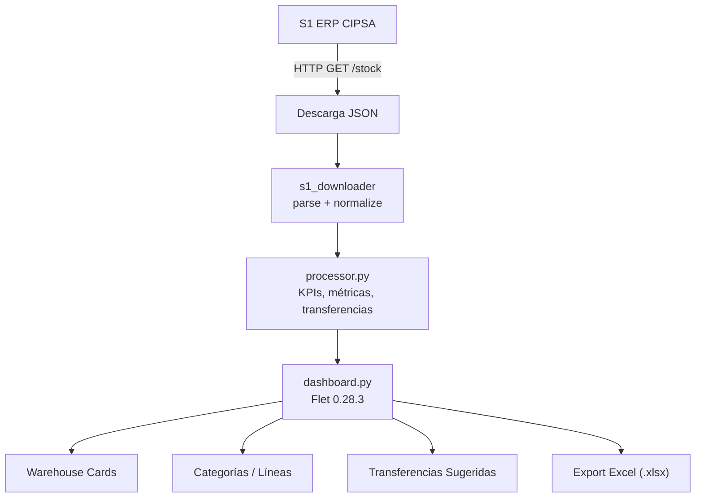

# G360 Stock Monitor

<picture>
  <source media="(prefers-color-scheme: dark)" srcset="assets/images/Logo_cipsa_solid.svg">
  
</picture>

> Monitoreo de stock en tiempo real desde S1 (ERP CIPSA) con visualización por almacenes, líneas de producto y categorías. Incluye detección de transferencias sugeridas entre almacenes con alertas por desbalance y stock crítico.

[](https://github.com/carloscus/g360-erp-stock-monitor)
[](https://python.org)
[](https://flet.dev)
[](https://opensource.org/licenses/MIT)

## ¿Cómo está organizado el proyecto?



## Tabla de Contenidos

- [Descripción](#descripción)
- [Características](#características)
- [Tecnologías](#tecnologías)
- [Versión](#versión)
- [Arquitectura](#arquitectura)
- [Estructura](#estructura)
- [Configuración](#configuración)
- [Dependencias](#dependencias)
- [Instalación](#instalación)
- [Inicio Rápido](#inicio-rápido)
- [Uso](#uso)
- [Portable](#portable)
- [Decision Log](#decision-log)
- [Contribución](#contribución)
- [Licencia](#licencia)
- [Ecosistema G360](#ecosistema-g360)

---

## Descripción

Aplicación de escritorio que monitorea stock en tiempo real desde el ERP de CIPSA (S1). Descarga datos JSON desde la API de S1, procesa datos por almacenes, líneas y categorías, y presenta un dashboard interactivo con KPIs, alertas y transferencias sugeridas.

**Tipo**: Desktop App (Portable)
**Framework**: Flet 0.28.3 (Flutter-based Python)
**Plataforma**: Windows 10/11
**Skill**: `cipsa` (marca CIPSA + signature "powered by G360")
**Author**: g360-stock-monitor

---

## Características

- **Dashboard general**: KPIs, warehouse cards, categorías, sidebar con search
- **Búsqueda flotante**: modal contextual con resultados en vivo (debounce 250ms) al escribir en la barra; Enter abre el primer resultado; Escape o click fuera cierra
- **Auto-limpieza al enfocar**: al hacer foco en la barra de búsqueda con texto previo, se limpia automáticamente para una nueva búsqueda rápida
- **8 KPIs clickables**: Almacenes, SKUs, Disponible, Predespacho, Sin Cat., Alertas, Críticos, Alto pred. — con glow backlight por color sólido
- **Tablas paginadas ordenables**: todos los modales con columnas tienen headers clicables con ciclo asc → desc → reset y encabezados alineados exactamente con los valores (mismo ancho)
- **Indicador de sort**: dirección ▲/▼ y columna activa mostrada en el título del diálogo
- **Health filter**: filtro por salud (Crítico/Alerta/OK) usando umbrales por cajas
- **Transferencias sugeridas**: detección automática de desbalance entre VES y secundarios, con sort propio en la sección
- **Exportación Excel**: nombres con timestamp (`G360_{slug}_{YYYYMMDD}_{HHMMSS}.xlsx`), author `g360-stock-monitor`, resumen optimizado (4 cols), detalle con Estado (BUENO/ALERTA/CRITICO)
- **Auto-refresh**: descarga cada 15 min; detecta cambios en metadata SKU (sin_catalogo, categoría) y reconstruye KPIs aunque raw data sea idéntico
- **Warehouse cards**: 3 modos de display (DESAGREGADO, CONSOLIDADO, PCT)
- **Categorías**: VINIBALL, VINIFAN, REPRESENTADAS con sus líneas
- **Sidebar**: search, chips de almacén, SKUs sin categoría, settings
- **Almacenes especiales automáticos**: los almacenes `s*` (s1, s13, etc.) se detectan y mapean dinámicamente con el mismo comportamiento que `118` (rol EXTERNO, informativo, sin control)
- **Reintentos API**: hasta 3 intentos con backoff exponencial para despertar Render en llamadas fuera de horario
- **Snapshot diff**: tendencia (up/down) vs snapshot anterior
- **5 motores de lectura Excel**: openpyxl, xlrd, csv, html, xml
- **Versión portable**: carpeta autónoma con launcher auto-instalable

---

## Tecnologías

| Tecnología | Uso |
|------------|-----|
| `flet[desktop]==0.28.3` | UI desktop (Flutter-based) |
| `requests` | Descarga HTTP JSON desde API S1 |
| `openpyxl` | Exportación de reportes Excel |
| `uv` | Gestión de entornos virtuales + launcher auto-instalable |
| `pyinstaller` | Build del .exe portable (distribución sin Python) |

---

## Versión

**Current: v1.0.0** — ver `pyproject.toml`

---

## Arquitectura

```
┌──────────────────────────────────────────────────────────────┐
│                  Flet Desktop App (0.28.3)                    │
│  ┌──────────┐  ┌──────────────────────────────────────────┐  │
│  │ Sidebar  │  │              Main Content                 │  │
│  │ (200px)  │  │  Header + KPIs + Transfers + Cards + Cat │  │
│  └──────────┘  └──────────────────────────────────────────┘  │
│                                                              │
│  ┌────────────────────────────────────────────────────────┐  │
│  │  src/core/                                             │  │
│  │    s1_downloader.py → descarga Excel desde S1          │  │
│  │    s1_downloader.py → parse JSON + normalize      │  │
│  │    processor.py      → KPIs, métricas, transferencias  │  │
│  │    constants.py      → URL, rutas                      │  │
│  └────────────────────────────────────────────────────────┘  │
└──────────────────────────────────────────────────────────────┘
```

### Capas

| Capa | Archivo | Responsabilidad |
|------|---------|-----------------|
| **Entry** | `main.py` | Boot, sys.path, `ft.app(main)` |
| **App** | `src/app.py` | Page setup, ciclo de vida, orquestación download → update, registro de FilePickers en overlay |
| **Core** | `src/core/s1_downloader.py` | HTTP GET a S1 API, parse JSON, populate SKU metadata (`sin_catalogo`, categoría, etc.) |
| **Core** | `src/core/processor.py` | KPIs por almacén, líneas, categorías, transferencias, export a Excel (nombres con timestamp, author `g360-stock-monitor`) |
| **UI** | `src/ui/dashboard.py` | Layout completo, sidebar, chips, KPIs, diálogos, sort, export |
| **UI** | `src/ui/warehouse_card.py` | Card por almacén con display condicional |
| **UI** | `src/ui/linea_section.py` | Categorías → líneas |
| **Config** | `src/config/theme.py` | Paleta esmeralda, colores, utility `rgba` |

### Data Flow

```
S1 (HTTP) → JSON → s1_downloader (parse) → dict[str, dict[str, dict]]
                                     ↓
                             processor.py
                            ├─ calcular_kpis_almacen(raw)
                            ├─ obtener_metricas_lineas(kpis)
                            ├─ obtener_metricas_categorias(kpis)
                            ├─ contar_sin_linea(raw)
                            └─ sugerir_transferencias(raw, config, search)
                                      ↓
                               dashboard.py
                            ├─ _build_kpi_row() → 8 KPIs (glow backlight, cards simétricas)
                            ├─ warehouse cards
                            ├─ linea_section
                            ├─ sidebar chips
                            ├─ _transfer_section (sort propio)
                            └─ _show_paginated_dlg (headers clicables, export con timestamp)
```

### Patrones

- **Callback-based**: `Dashboard.set_on_refresh(cb)`, `on_linea_click`, `on_click`
- **Snapshot diff**: cada warehouse guarda su `disponible_total` previo en JSON → muestra tendencia
- **Chips toggle**: `_selected_alms` set, toggle visual sin recrear
- **Headers reconstruidos por render**: evita controles duplicados al reabrir diálogos y garantiza alineación con las filas (ancho exacto por columna)
- **Ciclo de sort**: 1er click asc → 2º desc → 3º reset (orden original)
- **FilePicker en overlay**: `register_overlay()` agrega los pickers a `page.overlay` antes de su uso

---

## Estructura

```
g360-erp-stock-monitor/
├── main.py                          # Entry point (ft.app)
├── pyproject.toml                   # Python project metadata (flet==0.28.3)
├── requirements.txt                 # Pip deps
├── run.bat                          # Launcher con uv (5 pasos auto-instalable)
├── skill.json                       # Skill descriptor (cipsa)
├── sync_portable.py                 # Sincroniza raíz → carpeta portable
├── assets/
│   ├── data/
│   │   ├── lineas.json              # Config almacenes + líneas + umbrales
│   │   ├── catalogo_productos.json  # 1088 productos de CIPSA
│   │   ├── sample_data.json         # Fallback offline
│   │   └── _snapshot_*.json         # Snapshots por almacén (autogenerado)
│   └── images/
│       ├── Logo_cipsa_solid.svg     # Logo CIPSA en sidebar y README
│       ├── Logo_cipsa_solid.png     # Logo CIPSA (PNG)
│       ├── cipsa.ico                # Icono CIPSA (exe + acceso directo)
│       └── favicon.ico              # Favicon
├── src/
│   ├── app.py                       # StockMonitorApp (orquestador + overlay)
│   ├── config/
│   │   └── theme.py                 # Paleta esmeralda, rgba utility
│   ├── core/
│   │   ├── constants.py             # URL, rutas, ventana
│   │   ├── s1_downloader.py         # Download + parse S1 JSON
│   │   └── processor.py             # KPI engine, métricas, transferencias, export
│   └── ui/
│       ├── dashboard.py             # Layout + interactividad + sort + export
│       ├── warehouse_card.py        # Card de almacén (3 tipos display)
│       └── linea_section.py         # Categorías → líneas
└── g360-stock-monitor-portable/     # Distribución portable (sin Python)
```

---

## Configuración

### `lineas.json`

```json
{
  "almacenes": {
    "VES": {
      "nombre": "VES",
      "prioridad": 1,
      "tipo_reporte": "DESAGREGADO",
      "rol": "PRINCIPAL",
      "participa_control": true
    }
  },
  "umbrales": {
    "bajo_stock_unidades": 10,
    "critico_stock_unidades": 5,
    "porcentaje_alerta": 20,
    "dias_tendencia": 7
  }
}
```

### Health Filter (Umbrales por Cajas)

| Estado | Condición | Color |
|--------|-----------|-------|
| **Crítico** | `disp < un_bx` (menos de 1 caja) | Rojo `#ef4444` |
| **Alerta** | `un_bx <= disp <= un_bx * 5` (1 a 5 cajas) | Amarillo `#f59e0b` |
| **OK** | `disp > un_bx * 5` (más de 5 cajas) | Verde `#34d399` |

### Almacenes: Roles y Display

| Código | Nombre | Tipo Reporte | Rol | Control |
|--------|--------|--------------|-----|---------|
| **VES** | VES | DESAGREGADO | **PRINCIPAL** | Sí |
| **121** | CLVES_INSPECCION | CONSOLIDADO | SECUNDARIO | Sí |
| **129** | CLVES_OUTLET | DESAGREGADO | SECUNDARIO | Sí |
| **40** | APT | DESAGREGADO | SECUNDARIO | Sí |
| **118** | ALMACEN_118 | PCT | EXTERNO | No |
| **92** | INSPECCION | PCT | EXTERNO | No |
| **106** | OUTLET | PCT | EXTERNO | No |
| **122** | EXPORTACION | PCT | EXTERNO | No |
| **s\*** | ALMACEN_S\* (auto) | PCT | EXTERNO | No |

> Los almacenes `s1`, `s13`, `s2`, etc. que lleguen desde el API se configuran automáticamente con el mismo comportamiento que `118`: rol EXTERNO, tipo PCT, sin participación en control. No requieren entrada manual en `lineas.json`.

### Transferencias Sugeridas

Para cada SKU en VES (PRINCIPAL), evalúa secundarios ordenados por importancia:

| Tipo | Condición | Icono |
|------|-----------|-------|
| **Crítico** | VES disponible ≤ 5 y secundario tiene disponible > 0 | Warning |
| **Desbalance** | Secundario stock ≥ 3x VES stock y VES disp > 5 | Balance |

---

## Dependencias

| Paquete | Uso |
|---------|-----|
| flet (0.28.3) | UI framework (desktop) |
| requests | HTTP download JSON desde API S1 |
| openpyxl | Exportación de reportes Excel |

---

## Instalación

### Requisitos

- Windows 10/11
- Conexión a internet (solo primera ejecución)

### Rápido

```bash
git clone https://github.com/carloscus/g360-erp-stock-monitor.git
cd g360-erp-stock-monitor
run.bat
```

### Manual

```bash
uv venv .venv --python 3.11
uv sync
.venv\Scripts\python main.py
```

---

## Inicio Rápido

```bash
# 1. Ejecutar el launcher (auto-instala uv + Python 3.11 + deps)
run.bat

# O usar el launcher minimizado (sin consola visible)
launch.vbs
```

### Comandos G360-CLI

```bash
# Ver estructura del proyecto
g360 present

# Auditar compliance con estándares G360
g360 audit

# Traer assets de marca actualizados
g360 bring brand

# Generar/actualizar documentación automáticamente
g360 docs --level readme
```

---

## Uso

1. Ejecutar `run.bat` (auto-instala todo) o `launch.vbs` (ventana minimizada)
2. La app descarga datos desde S1 automáticamente
3. Explorar dashboard: KPIs, warehouse cards, categorías
4. Usar sidebar para filtrar por almacén o buscar SKU
5. Revisar transferencias sugeridas
6. **Ordenar tablas**: clic en cualquier header de los diálogos (asc → desc → reset). La columna y dirección activas (▲/▼) se muestran en el título
7. **Exportar a Excel**: en los diálogos paginados, "Exportar Excel" abre el diálogo de configuración y luego el guardado nativo del sistema

---

## Portable

El proyecto incluye `g360-stock-monitor-portable/` para distribución a PCs sin Python.

| Archivo | Propósito |
|---------|-----------|
| `run.bat` | Launcher 5 pasos: uv → Python → deps → update → app |
| `launch.vbs` | Lanzador minimizado (evita consola visible) |
| `create_shortcut.vbs` | Acceso directo en escritorio con icono CIPSA |
| `sync_portable.py` | Sincroniza `src/`, `assets/`, `README.md` y archivos raíz a `g360-stock-monitor-portable/` |

### Flujo de desarrollo vs distribución

**Repositorio (versión desarrollo):**
- Contiene código fuente, configuración y scripts de instalación
- `.gitignore` excluye `.venv/`, `*-portable/`, `*.exe`, logs, pycache
- `run.bat` auto-instala uv, Python 3.11, crea venv, instala deps y lanza la app
- `launch.vbs` ejecuta `run.bat` minimizado para no mostrar consola

**Carpeta portable (versión distribución):**
- Se genera con `python sync_portable.py`
- Contiene TODO preinstalado: `.venv/`, `src/`, `assets/`, `run.bat`, `launch.vbs`
- No requiere internet ni permisos de instalación en PC destino
- Solo incluye archivos necesarios para ejecutar (sin `uv.lock`, `sync_portable.py`, `skill.json`)

```bash
# Sincronizar cambios a la carpeta portable
python sync_portable.py

# En PC destino: ejecutar el launcher minimizado
g360-stock-monitor-portable\launch.vbs
```

---

## Decision Log

| Fecha | Decisión | Razón |
|-------|----------|-------|
| May 2026 | `disponible` desde col19 | VBA original usa col19 como fuente de confianza |
| May 2026 | Categorías filtradas (3) | OTROS sin línea no aporta valor |
| May 2026 | Health filter por cajas (`un_bx`) | `un_bx` varía por producto; umbral fijo es impreciso |
| May 2026 | KPI dialogs ignoran filtro de salud | Usuario necesita ver totales reales |
| May 2026 | Launcher 5 pasos auto-instala | Experiencia zero-setup en PC limpia |
| Jul 2026 | Sort solo en headers (sin barra de chips) | Evitaba doble encabezado y desalineación |
| Jul 2026 | Headers con ancho exacto + GestureDetector | Encabezados alineados pixel-perfect con los valores |
| Jul 2026 | Indicador ▲/▼ en el título del diálogo | Dirección de sort visible sin desalinear la tabla |
| Jul 2026 | FilePicker registrado en `page.overlay` | `save_file()`/`pick_files()` fallan si el picker no está en el overlay |
| Jul 2026 | Icono CIPSA oficial (`cipsa.ico`) | `build-portable.bat` y `create_shortcut.vbs` lo referenciaban sin existir |
| Ago 2026 | Búsqueda flotante con debounce | Resultados en vivo sin rebuild del dashboard completo |
| Ago 2026 | Auto-limpieza al enfocar búsqueda | Flet no expone `select_all()`; limpiar es el equivalente más ágil |
| Ago 2026 | Reintentos API (3 intentos + backoff) | Despertar Render en llamadas fuera de horario |
| Ago 2026 | Mapeo automático almacenes `s*` | Mismo comportamiento que 118 sin config manual |
| Ago 2026 | Auto-refresh con metadata hash | Detecta cambios en sin_catalogo/categoría aunque raw data no varíe |
| Ago 2026 | KPIs con glow backlight unificado | Todas las cards tienen el mismo tratamiento visual con color sólido |
| Ago 2026 | Nombres de archivo Excel con timestamp | Formato `G360_{slug}_{YYYYMMDD}_{HHMMSS}.xlsx`, author `g360-stock-monitor` |
| Ago 2026 | Badge refresh con update() | Se agregó `.update()` después de cada cambio de propiedades para que el timer se refresque cada tick (1s) |
| Ago 2026 | Timezone en badge | La API envía `fecha_descarga` en Lima (UTC-5) con offset explícito; se usa `replace(tzinfo=None)` para comparar con `datetime.now()` sin conversion |
| Ago 2026 | Captura de `fecha_descarga` | La API no envía timestamp estándar; se agrega `fecha_descarga` a `API_TIMESTAMP_KEYS` para capturar la hora real del reporte |
| Ago 2026 | Badge TTL dinámico del API | Lee `cache_expiro_en` (900s) y `cache_expirado` del API; muestra tiempo restante, estado del cache (activo/vencido/expirado) y colores según TTL real |
| Ago 2026 | Umbral warn >= TTL | El badge cambia a amarillo cuando `age >= ttl` (no `> ttl`) para detectar expiración inmediata al cumplirse el TTL |
| Ago 2026 | Fix import `get_api_sku_meta` | Se agregó al import en `app.py`; su ausencia causaba crash silencioso en el executor al hacer hash de metadata |

---

## Contribución

1. Fork el repositorio
2. Crea una rama (`git checkout -b feature/nueva-funcion`)
3. Commit cambios (`git commit -m 'Agregar funcion'`)
4. Push a la rama (`git push origin feature/nueva-funcion`)
5. Abre un Pull Request

---

## Licencia

MIT License - ver [LICENSE](LICENSE) para más detalles.

---

## Ecosistema G360

Este proyecto forma parte de la familia de microherramientas **G360** para apoyo CRM y gestión de datos en escritorio, enfocadas en áreas como ventas, finanzas y logística.

### Identidad Visual G360

| Elemento | Valor |
|----------|-------|
| Marca | CIPSA (skill `cipsa`) |
| Color primario | `#00d084` (verde) |
| Signature mode | `powered` |
| Signature text | "powered by G360" |
| Logo | `logotypes/Logo_cipsa_solid.svg` |

### Herramientas Relacionadas

- **[g360-cli](https://github.com/carloscus/g360-cli)**: Bootstrap de proyectos G360 (CLI, plantillas, brand, auditoría)
- **[g360-signature](https://github.com/carloscus/g360-signature)**: Web component de branding G360
- **[g360-order-xlsx](https://github.com/carloscus/g360-order-xlsx)**: Procesador de cotizaciones Excel
- **[g360-day-calculator](https://github.com/carloscus/g360-day-calculator)**: Calculadora de días laborables
- **[g360-master-data](https://github.com/carloscus/g360-master-data)**: Gestión de datos maestros
- **[g360-signature-creator](https://github.com/carloscus/g360-signature-creator)**: Generador de firmas corporativas

---

**Marca**: G360 · **Isotipo**: 3 puntos verticales paralelos (gris-verde-gris) + chevron `>`
**Signature**: powered by G360 · **Powered by**: [g360-signature](https://github.com/carloscus/g360-signature)
- **Autor**: Carlos Cusi
- **Desarrollo**: Con asistencia de herramientas de código IA (Vibe Code)

## Footer Signature

```html
<g360-signature mode="powered"></g360-signature>
```

> Identidad generada desde el Brand System de `g360-cli` (`brand.json` v2.0.0).
